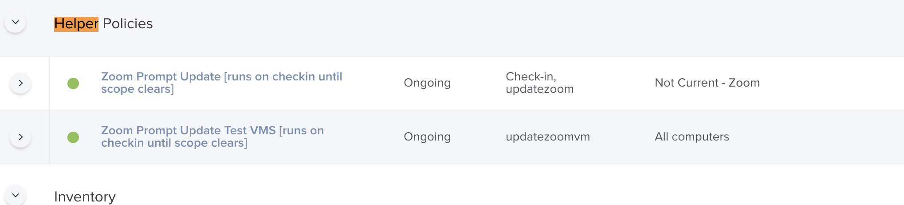

# Auto-Update
Automatically update apps with jamf policy driven workflows


Documentation will be in this repo's [Wiki page](https://github.com/t-lark/Auto-Update/wiki), please click on the wiki link above

Thanks

# Let's Work Backwards, Manually Make The Helper Policies:

## Graphical Spoiler

## Policy Categorisation



## My Fork's Parameters in JSS 


### Explain please
Helper Policies excecute the policies automatically created by JSSI in a elegant manner.

---
# https://github.com/zackn9ne/Auto-Update.git
* **Policy: Silent Update AppName** [silent update.py](https://github.com/t-lark/Auto-Update/blob/master/silent_update.py) Tries to update if app is running just skips it and will try on next check in. You have to put the below in your policy:

1. Put in `$4` BundleID in your JSS
2. put in `$5 ` The policy-trigger you want eg `jamf policy -event updatethingname` in your JSS

* **Policy: Patch App Quitter AppName** [app quitter.py](https://github.com/t-lark/Auto-Update/blob/master/app_quitter.py) If app is running presents a nice pop up window with branding to ask the user if they wanna quit it and run the updates. If they cancle it will just try on next check in anyway. _What's cool about Patch App Quitter is if the App isn't running it will just update._ You have to put the below in your policy:

1. `$4` com.microsoft.Excel
2. `$5` true
3. `$6` Excel
4. `$7` autopudate-Microsoft Excel
5. `$8` false
6. `$9` Companyname + Advisory
7. `$10` /Library/ADVisory/logonew.png
# How to utilise this with JSSI?
JSSI Creates Two Important Dependancies
### (1) Policy Side: "Install Latest Thing"
* Creates a Policy in JSS
* "thing" = %PROD_NAME%
* Attaches latestversion.pkg to policy 
* Sets to run latestversion.pkg installer
* Has a scope likely of all computer
* Has a custom trigger called autoupdate-%PROD_NAME%
* Is liekly ongoing
* Because we are going to leverage Tlark's Silent Updater or Tlakr's Prompt App Quiter
* All we really care about it's a trigger we can call, and it has the latest package

### (2) Smart Groups Side: "Thing-update-smart"
* "thing" = %NAME%
* If app exists and is not current version
* Named %group_name% most likely `%NAME%-update-smart`

# How To Scale This?
1. Make a Recipie Override which Calls 2 XML Files
2. Make XML File 1 Which customises forthcoming Policy
3. Make XML File 2 Which customises forthcoming SmartGroup


### So How am I supposed to do that?(read next 3 steps) 

### [1/3]
* It's because your using a Recipie Override, editing the Recipie Override's following directives
* Specificly the `GROUP_NAME` directive
* The `GROUP_TEMPLATE` and `POLICY_TEMPLATE`
 directive in the recipie Override itself. Note path scoping likes the same directory. _Pictured below is the start of a Recipie Override featuring the above directives in view_

```
<?xml version="1.0" encoding="UTF-8"?>
<!DOCTYPE plist PUBLIC "-//Apple//DTD PLIST 1.0//EN" "http://www.apple.com/DTDs/PropertyList-1.0.dtd">
<plist version="1.0">
<dict>
	<key>Identifier</key>
	<string>local.jss.AU-DriveFS</string>
	<key>Input</key>
	<dict>
		<key>CATEGORY</key>
		<string>Patches</string>
		<key>DOWNLOAD_URL</key>
		<string>https://dl.google.com/drive-file-stream/googledrivefilestream.dmg</string>
		<key>GROUP_NAME</key>
		<string>%NAME%-update-smart</string>
		<key>GROUP_TEMPLATE</key>
		<string>SmartGroupTemplateAutopatch.xml</string>
		<key>NAME</key>
		<string>Google Drive File Stream</string>
		<key>POLICY_CATEGORY</key>
		<string>Patches</string>
		<key>POLICY_TEMPLATE</key>
		<string>PolicyTemplateAutopatch.xml</string>
		<key>SELF_SERVICE_DESCRIPTION</key>
		<string></string>
		<key>SELF_SERVICE_ICON</key>
		<string>%NAME%.png</string>
		<key>STOPPROCESSINGIF_PREDICATE</key>
		<string>download_changed == False</string>
		<key>pkg_path</key>
		<string></string>
	</dict>
```

### [2/3]
*Edit PolicyTemplateAutopatch.xml*

```
<policy>
    <general>
        <name>Install Latest %PROD_NAME%</name>
        <enabled>True</enabled>
        <frequency>Ongoing</frequency>
        <category>
            <name>%POLICY_CATEGORY%</name>
        </category>
        <trigger_other>autoupdate-%PROD_NAME%</trigger_other>
    </general>
    <scope>
        <all_computers>true</all_computers>
    </scope>
    <package_configuration>
        <!--Package added by JSSImporter-->
    </package_configuration>
    <scripts>
        <!--Scripts added by JSSImporter-->
    </scripts>
    <maintenance>
        <recon>true</recon>
    </maintenance>
</policy>
```

### [3/3]
**Edit SmartGroupTemplateAutopatch.xml**

```<computer_group>
    <name>%group_name%</name>
    <is_smart>true</is_smart>
    <criteria>
        <criterion>
            <name>Application Title</name>
            <priority>0</priority>
            <and_or>and</and_or>
            <search_type>is</search_type>
            <value>%JSS_INVENTORY_NAME%</value>
        </criterion>
        <criterion>
            <name>Application Version</name>
            <priority>1</priority>
            <and_or>and</and_or>
            <search_type>is not</search_type>
            <value>%VERSION%</value>
        </criterion>
    </criteria>
</computer_group>
```

### What happens on JSS, how do I look for what I did?

1. You made a smart group with a scope which checks app version
2. You made a policy which runs the freshly upload pkg version based on a trigger

# How Do We Run This?
### Call autopkg from the command line please
#### you should `autopkg list-recipes` to see what's available then you can call that via name

* `autopkg  run -vv --post 'io.github.hjuutilainen.VirusTotalAnalyzer/VirusTotalAnalyzer' AU-Zoom.jss --prefs ~/Desktop/myawesomecompany.plist`

#### you can call in a more declative way if you are a beginner 

* `autopkg  run -vv --post 'io.github.hjuutilainen.VirusTotalAnalyzer/VirusTotalAnalyzer' ~/Desktop/Autopkgr-Overrides/AU-Zoom.jss.recipe --prefs ~/Desktop/myawesomecompany.plist`

### Breakdown
* `--post` because virus check
* `local.jss.AU-Zoom` is the package, you can string multiples of these together to call a bunch at a time
* `--prefs` point this at your .plist containing your whitelisted recipies and your credentials

	Q: how do we make the .plist?
	
	A: I would just use the AutoPkgr gui, save your connection settings and `cp ~/Library/Preferences/com.github.autopkg.plist ~/Desktop/myawesomecompany.plist`
	
	Q: how can I read the preferences as a sanity check? 
	
	A: `defaults read com.github.autopkg.plist` or `plutil -convert xml1 ~/Desktop/myawesomecompany.plist `
	
# Troubleshooting
* `autopkg list-recipes`
* `autopkg info AU-Zoom.jss`
* `autopkg run --post novirus path_to_recipie_override --prefs login_creds_yoursite.plist --key STOP_IF_NO_JSS_UPLOAD=False`

